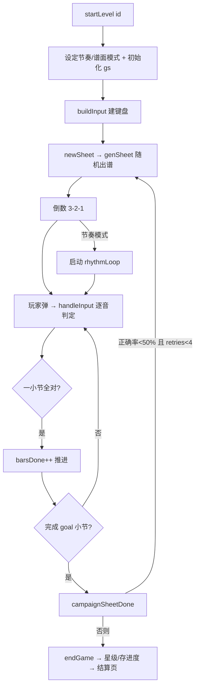

# Piano Clash 架构说明（ARCHITECTURE）

> 钢琴视奏对战游戏。目标：让练琴像打游戏一样上瘾。
> 本文件描述**代码的运行逻辑与结构**，供协作者阅读、也方便后续改动对照。
> 对应版本：`APP_VERSION`（见 `index.html`，当前 3.9.0）。

---

## 1. 技术约束（改动前必读）

- **单文件应用**：全部代码在一个 `index.html` 里（约 6200 行，内联 CSS/JS）。**无框架、无构建步骤**（不是 React/Vue，之前评估过 React 版因缺少真实 Firebase 多人对战被否决）。
- **只依赖两个 CDN**：
  - Firebase（联机对战 / Google 登录 / 进度云同步）
  - `xlsx`（键位 Excel 导入）
  - 其余全部原生实现（含五线谱渲染、音频合成、音高检测、OMR 预处理）。
- **五线谱是 `<canvas>` 画的**，不是 DOM。谱号/音符用 **Bravura SMuFL 字体** 绘制。改谱面外观要改 canvas 代码，不是 CSS。
- **钢琴键盘、按钮、菜单是普通 HTML/CSS**，可自由用 CSS 调整。
- **PWA**：`manifest.json` + `sw.js`（service worker，网络优先、离线回退），可「添加到主屏幕」安装。
- **移动优先 + 中英双语 + 深色主题**。

---

## 2. 文件与代码分区

单文件内部用 `═══` / `──` 注释横幅分区。主要区块（按出现顺序）：

| 区块 | 作用 |
|---|---|
| `<head>` CSS | 全局样式、响应式媒体查询、深色主题（AI Studio 设计系统）、Dashboard 样式 |
| Firebase `<script type="module">` | 初始化 Firebase，挂 `window.FB` / `window.myId` |
| 各 `<div class="screen">` | 所有界面（登录、Dashboard、关卡、流行曲、拍照、MIDI、麦克风、大厅、房间、游戏、结算…）|
| 主 `<script>` | 全部逻辑，下列各节 |
| i18n | 中/英文案表 + `applyLang()` |
| CANVAS / STAFF RENDERING | `initCv` `rz` `draw` 及三种谱面视图 |
| BRAVURA SMuFL GLYPHS | 音符/谱号字形 |
| PIANO KEYBOARD | `buildPiano`（全音域）/ `buildSolfege`（单八度）|
| SHEET GENERATION | `genSheet` 随机出谱 |
| CAMPAIGN / RANDOM / DAILY / WEAK / BOT / SONG 各模式 | 各自的开始/结束流程 |
| SONG import + OMR | `parseMusicXML` / `photoToSheet` |
| LOBBY / ROOM（Firebase） | 联机大厅与房间 |
| WEB MIDI | `connectMIDI` `onMIDIMessage` + 验证监视器 |
| MIC PITCH DETECTION | NSDF（McLeod）音高检测 |
| 启动 | `DOMContentLoaded` 初始化、`show` 包装 |

> 注：本文档刻意**不写具体行号**（会随改动漂移），用函数名/横幅名定位。

---

## 3. 启动顺序

1. Firebase 模块脚本先跑：连实时数据库、配置 Google 登录，成功则挂 `window.FB`、监听 `onAuthStateChanged` 设置 `window.myId`；失败 `window.FB=null`（不影响单机）。
2. 主脚本定义全部函数与状态。
3. `DOMContentLoaded`：`initCv()` 取 canvas 上下文 → `applyLang()` 注入文案 → 读版本号/昵称/音量 → 解析 URL `?room=` 房间码（存 sessionStorage，登录后再加入）。
4. `show` 被包一层（`_origShow`）：每次切屏顺带执行该屏的初始化钩子（进 MIDI 页刷新状态、进主菜单渲染 Dashboard 等）。
5. 若 https/localhost，注册 `sw.js`（PWA）。

---

## 4. 屏幕系统（单页应用）

所有界面是同一页里的 `<div class="screen">`，靠 **`show(id)`** 切换：移除所有 `.active`、给目标加 `.active`（`.screen.active{display:flex}`）。**没有路由、没有页面跳转**。

---

## 5. 状态与存储

- **`gs`** — 当前一局的游戏状态：`sheet`（谱面）、`curBar`/`curNote`（进度）、`score`/`notesOK`/`notesWrong`/`barsDone`/`maxCombo`、`_retries` 等。一局的一切都在此。
- **`SC`** — 屏幕/画布度量：宽高、每格高 `hs`、行数、谱表 Y 坐标、`displayBars`。`rz()` 在 resize/旋转时重算。
- **`gameKind`** — `campaign｜practice｜online｜bot｜song｜custom`，判定后据此分支。
- **持久化（localStorage）**：`psr3`=关卡进度；`psr_*`=各项设置（音量、MIDI 声音来源、拍照 Key、识别模式、单/双手 OMR…）；`psr_songs`=导入曲目。
- **云同步**：登录用户经 `sp()` 把进度 `set` 到 Firebase `users/<uid>/progress`。

---

## 6. 渲染管线（Canvas）

谱面全部 canvas 绘制。核心是 **`draw()` 分发器**：

```
draw()
  铺 Simply-Piano 青色渐变底 (sheetGrad)
  ├─ flowMode && rhythmMode → drawFlowView()      节奏流动：音符右→左飘过左侧「命中光带」
  ├─ sheetDisplay==='scroll' → drawScrollFollow()  玩家自定节奏：当前音停在光带下
  └─ 默认 → 静态大谱表：drawStaffLines / drawClefs / drawTimeSig / drawBars
```

- `rz()`：布局重算（响应式 / 旋转 / `100dvh` / 安全区）。
- 两个 `requestAnimationFrame` 循环：
  - **`scrollLoop`**（`ensureScroll` 触发）——滚动到位即停，省电。
  - **`rhythmLoop`**（`buildRhythmSchedule` 排程）——节奏模式的时间驱动。
- `drawPlayBand()` 画 Simply-Piano 风格白色「现在弹」光带。

---

## 7. 输入 → 判定（最关键的一条链）

所有输入最终汇入 **`handleInput(note, isSolInput, srcMic, noSound)`**：

| 输入方式 | 构建/来源 | 备注 |
|---|---|---|
| 🎹 屏幕钢琴键 | `buildPiano()` | 全音域 C2–C6，可滚动 |
| 🎹 单八度琴 | `buildSolfege()` | 原「Do Re Mi」；按音级判定、忽略八度；手机友好 |
| ⌨️ 电脑键盘 | 键位映射 | 可自定义 |
| 🎹 MIDI | `onMIDIMessage` | **仅桌面 Chrome/Edge/安卓**；iOS/iPadOS 不支持（Apple 限制）|
| 🎙 麦克风 | `micLoop` + NSDF | 弹真钢琴，无需任何设备 |

`handleInput` 判定要点：
- **单八度/solfège 模式**：严格逐音、按音级（`nd.sol`）匹配，忽略八度与升降号。
- **钢琴模式**：和弦感知——同一拍的音组里，任意未匹配且音高相符的音都算对。
- 命中 → 音符变绿、加分（连击倍率 × 节奏时机倍率）；节奏模式再判 `PERFECT/GOOD/OK/MISS`。
- 一小节全部命中 → `barsDone++`、过关音效、推进到下一小节。

---

## 8. 一局的生命周期（以关卡模式为例）



其它模式（随机 `startRandom`、每日、弱点特训、流行曲 `startSongGame`、人机 `bot`、联机、练习编谱 `custom`）**复用同一套核心**（`genSheet`/`buildSongBars` + `handleInput`），差异只在**出谱来源**与**结束条件**。

---

## 9. 谱面数据模型

任何来源的谱都统一成：

```js
song = { title, ts, bpm, key?, bars: [ { ts, notes: [ {n, d, hand?, beat?} ] } ] }
// n=科学音名(C4=中央C)  d=时值(w/hd/h/q/e/s)  hand='R'|'L'  beat=小节内起拍
```

**`buildSongBars(song)`** 把它转成渲染就绪结构：按谱表（treble/bass）分**独立拍子轴**，让左右手同拍对齐。
- 若音符带 `beat`（来自 MusicXML）→ 用精确起拍；否则按时值在各谱表内累加（拍照 OMR / 内置关卡）。
- 若带 `hand` → 据此定谱表；否则按音高（`clefFor`：≥C4 归高音谱表）。

---

## 10. 导入与拍照识别（拿到「正确谱」）

- **MusicXML 导入**（`parseMusicXML`）：**真正的双手解析**——按小节走时间游标，处理 `<backup>`/`<forward>`、`<staff>`（1=右手 2=左手）、和弦、休止符，输出上面的统一结构。这是拿到**100% 正确双手谱**的可靠途径（配合 MuseScore 导出）。
- **拍照识别 OMR**（`photoToSheet`）：图像预处理（去斜/增强/放大）→ 按谱行（system）横向切分 → **逐行**喂 Gemini（优先 pro 模型，`geminiBatchCall` 复用已解析模型）→ 拼回统一结构。有「完整双手 / 只右手旋律」两档。**通用大模型 OMR 精度有天花板**，仅作快速草稿；要精确走 MusicXML 导入。

---

## 11. 联机（Firebase 实时数据库）

- 大厅 `refreshLobby` 列公开房间；创建/加入/准备/开始读写 `rooms/<code>`。
- `onRoomUpdate` 监听房间数据，同步对手进度到对战条。
- **人机模式（bot）** 是本地模拟对手，不走网络。

---

## 12. 横向能力

- **音频**：WebAudio 合成器；`ea()` 懒初始化 `AudioContext`（需用户手势），`playPiano()` 发声；`masterGain` 控音量。
- **i18n**：中/英两张文案表，`data-i18n` 属性 + `applyLang()` 注入。
- **响应式**：媒体查询（平板/手机/超小屏）+ `@media(orientation:landscape)` 横屏规则 + `100dvh` + `env(safe-area-inset-*)` 安全区（适配 iPhone/iPad 横屏与刘海/Home 横条）。
- **主题**：深色（AI Studio 设计系统）。
- **PWA**：`sw.js` 网络优先缓存；主菜单提供安装入口。

---

## 13. 一句话总览

> `show()` 切界面 → 各模式产出统一的 `song`/`gs` → canvas `draw()` 三选一渲染谱面 → 多种输入统一进 `handleInput` 判定打分 → 完成/失败决定重来或结算 → 进度存 `localStorage`（登录再同步 Firebase）。

---

## 14. 开发与验证约定

- **改代码**：直接编辑 `index.html`；每次功能改动**递增 `APP_VERSION`**（缓存 busting + 用户可见版本号）。
- **语法自检**：抽出主 `<script>` 跑 `node --check`（无构建，靠此兜住语法错）。
- **可视/逻辑验证**：用 Playwright + 预装 Chromium（`/opt/pw-browsers/chromium`）截图或直接调函数验证（连续 rAF 场景用 CDP `Page.captureScreenshot`）。
- **分支**：在 `claude/project-content-check-kmm4qk` 开发，提交后 `--ff-only` 合到 `main`，两边都推。
